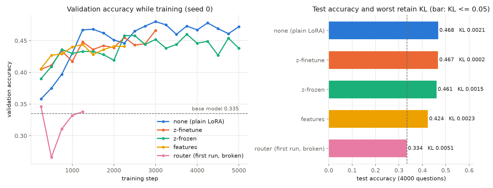

# Hypermodel

A research project on whether a model's own internal activity can tell it how to fix itself.

A small second network (the **observer**) reads a base model's hidden states while it answers a question.
An **editor** turns what the observer saw into a temporary low-rank edit of the base model's weights, and the
edited model answers again. Later stages make edits persist and let the hypermodel edit itself on a slower
clock, with every self-edit gated by a fixed evaluator it cannot change.

The current testbed is deliberately small: **Qwen3-0.6B-Base** on synthetic multiplication (2-digit x 3-digit,
few-shot, greedy, exact match). The base model gets **33.5%** of held-out questions right.

## The question each step tests

| Step | Question | Status |
|---|---|---|
| 1. Traces | Record residual-stream states at the operand and final tokens (layers 9, 14, 19). | done |
| 2. Observer | Can a learned code `z` (64 dims) read from those states predict whether the answer will be right? | done |
| 3. Transient editor | Does conditioning a per-question weight edit on `z` beat edits that do not look at the model's internals? | in progress |
| 4. Persistent editor | Accumulate edits over a task stream, accepted only if a fixed evaluator approves. | planned |
| 5-6. Self-tuning, self-editing | The hypermodel sets its own hyperparameters, then edits its own weights, through the same gate. | planned |
| 7. Scale up | Repeat on a larger model. | planned |

### Step 2 result

`z` predicts correctness with AUROC **0.910** on 4000 held-out questions, matching hand-made question features
(0.900 linear, 0.906 MLP). Under greedy decoding, correctness is almost a function of the question, so the
observer recovering that unaided is the pass condition. Whether `z` carries anything *beyond* the question
is the job of step 3.

## Step 3: what is being compared

Every variant trains the same small adapter: a bank of 8 rank-8 LoRA experts on the MLP output projection of
layers 12, 15, 18 and 21 (about 1M parameters), with the base weights frozen. Training minimises answer loss
plus a **retain** penalty, the KL divergence from the unedited model on unrelated text and other arithmetic,
so the edit cannot quietly break everything else. The variants differ only in what picks the mix of experts:

| Variant | Mixing chosen by | What it controls for |
|---|---|---|
| `none` | a fixed learned mix (plain LoRA fine-tuning) | the standard baseline |
| `features` | the question's operands | "it only needs to know the question" |
| `z-frozen` | `z` from the step 2 observer, observer frozen | does the pretrained read help as is? |
| `z-finetune` | `z`, observer fine-tuned end to end | the main hypothesis |
| `z-shuffled` | `z-finetune` with each input given another input's trace | is it `z`'s information, or just extra trainable capacity? |
| `router` | the current hidden state at each token (mixture-of-LoRA-experts style) | the standard per-token routing recipe |

**Pass bar** (fixed before the results): on 4000 held-out questions over 3 seeds, the `z` editor beats base
accuracy, keeps retain KL at or below 0.05 nats/token on every retain source, and beats both `none` and
`features` with a paired-bootstrap 95% CI that excludes zero. Failing the last part is a valid result.

### Results so far (seed 0 only, provisional)

| Variant | Test accuracy | vs plain LoRA (95% CI, pts) | Worst retain KL |
|---|---|---|---|
| base model | 0.335 | | |
| `none` (plain LoRA) | 0.468 | | 0.0021 |
| `z-finetune` | 0.467 | -0.05 [-1.1, +1.0] | 0.0002 |
| `z-frozen` | 0.461 | -0.7 [-1.8, +0.5] | 0.0015 |
| `features`* | 0.424 | -4.4 [-5.6, -3.2] | 0.0023 |

\* Stopped early at 2250 steps; the others ran to 5000 (`z-finetune` to 3000).



So far nothing beats plain LoRA on accuracy. `z-finetune` ties it while answering 12% of questions
differently and keeping about 10x less drift on unrelated inputs, but it also has 3.4x the trainable
parameters, which is what `z-shuffled` tests. The first `router` run did not learn (fixed since, rerun pending).
Seeds 1 and 2 and the shuffled control are next.

## Running it

```bash
uv sync
uv run pytest                      # full suite, ~2-3 min; -m "not slow" for the fast subset
uv run python -m hypermodel.edit_train --traces runs/traces-mul-2x3-20k \
    --conditioning z-finetune --out runs/edit-z-finetune-s0
uv run python -m hypermodel.watch  # live training curves for every runs/edit-* directory
```

Traces and checkpoints (`runs/`) are not in the repo; `hypermodel.trace` and `hypermodel.observer` regenerate
them. One 8 GB GPU is enough for everything above. Set `CUDA_VISIBLE_DEVICES=-1` to test on CPU.

## Layout

`src/hypermodel/`: `arithmetic` (task and difficulty dial), `adapter` (model-agnostic hooks), `scoring`,
`trace`, `probe` / `contrastive` / `sae` / `observer` (step 2), `editor` (LoRA bank), `condition` (mixers),
`retain` (retain set and KL), `edit_train` (step 3 train/eval CLI), `watch`.

Design decisions and their alternatives are logged in [`DECISIONS.md`](DECISIONS.md).
